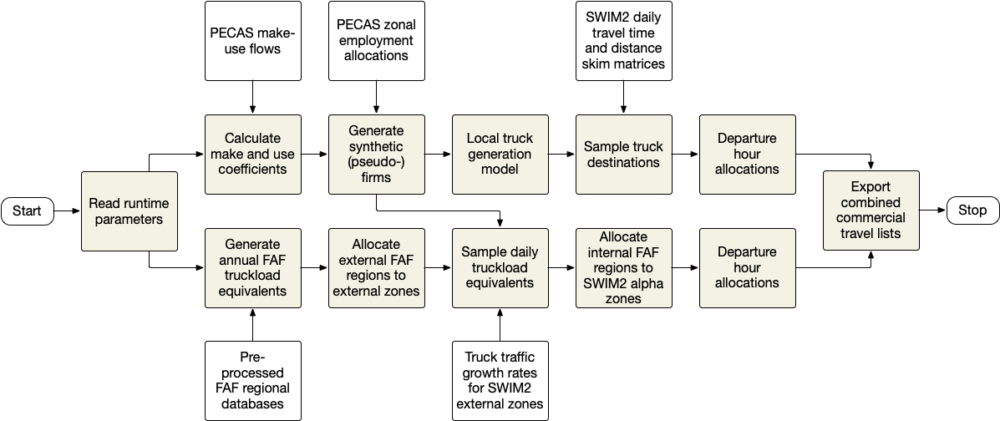

The commercial travel (CT) module simulates freight and non-freight truck flows within the SWIM modeled area. The demand for local versus long-distance travel are modeled separately using multi-agent models written in the [R statistical language](http://r-project.org), with the components shown below. The CT module begins by creating synthetic pseudo-firms, based upon employment estimates by industry and input-output coefficients created in each SWIM simulation year by the AA module. Because AA focuses primarily upon Oregon and the halo the FHWA [Freight Analysis Framework (FAF)](http://ops.fhwa.dot.gov/FREIGHT/freight_analysis/faf/index.htm) commodity flow data are used to depict inter-regional freight flows in both the base and forecast years. A detailed description of the model and its derivation can be found in the _SWIM v2.5 Model Development Guide_. The discussion in this section focuses upon the conceptual basis of the CT model, recommended uses, input and output data, and a discussion of how trucker values of time (VOT) might be considered when using the SWIM models.

### Conceptual basis and history

The AA and CT modules have evolved with varying degrees of integration and consistency over the years. AA is similar in many respects to classical multi-region input-output models in formulation and output data, although with higher level of spatial and temporal resolution than similar approaches such as the [TRANUS model](http://www.tranus.com/tranus-english), used in the first generation TLUMIP work, and [MEPLAN](https://www.tandfonline.com/doi/abs/10.1080/01441649008716764). From a freight modeling standpoint AA produces several useful outputs, to include production-consumption (PC) matrices by commodity and make and use coefficients. These represent state of the art inputs to commodity flow modeling even today, and have been used in one form or another throughout the evolution of the CT model.

The original CT prototype pre-dated AA and focused mostly on intercity truck flows. It munged aggregate data from the 1997 and 2003 [Commodity Flow Survey](https://www.bts.gov/cfs) (CFS) and microdata from the 2002 [Vehicle Inventory and Use Survey](https://www.census.gov/econ/overview/se0501.html) (VIUS). When AA came part of the SWIM system CT was updated to directly use the PC matrices to depict OD flows at the beta zone level. The make and use coefficients were also used to allocate commodity flows to specific alpha zones within each beta zone. Truckload equivalents (tons to trucks) were derived from the preliminary 2007 CFS data. This model validated poorly to truck counts and OD patterns gleaned from truck intercept surveys at ODOT weigh stations conducted in 1997-98 while developing the first generation statewide model in TRANUS. It was thought at the time that further calibration of AA would likely improve the results, and various ways of allocating flows to external markets to specific external stations were explored.

The later availability of the FAF was a game-changer, although Versions 1 and 2 did not compare well with the truck intercept surveys, either. The quality of the data appeared to improve dramatically starting in Version 3.2, and the current Version 5 appears to provide robust commodity OD tonnage and value data by primary mode of transport and commodity. When Version 3.2 was released CT was updated to fuse the FAF data with PC matrices from AA, but the inconsistencies between them were so great that efforts were suspended, again assuming that further calibration of AA would resolve the inconsistencies. After experimenting with several different approaches we found that using the AA make and use coefficients to allocate the FAF flows directly to alpha zones validated the best.

In TLUMIP5 lining up the PC flows from AA with the FAF was again attempted. Large discrepancies remained and the process for transforming PC flows to truckload equivalents validated poorly. By contrast, continued improvements in the FAF, coupled with updated AA make and use coefficients, continued to work best. At this writing the two models remain only loosely integrated, and reveal inconsistent patterns as a result. However, directly comparing the two models is difficult for several reasons. Validating CT to truck intercept surveys and counts makes sense, but it only demonstrates that CT is generating the correct number of trucks by type (light, medium, heavy) and with plausible OD patterns. There is considerable entropy in the latter, and the counts reveal nothing about what is carried inside the trucks. It is conceivable that the AA commodity flow patterns are more robust than the FAF flows, which have never been validated at regional or national levels. However, validation of the CT simulated flows in Oregon suggest the opposite is true. 

A long-term solution that would improve both models would use the FAF and CFS 2012 microdata as constraints (or maybe targets) in NED and AA. That would require a significant undertaking, for there are bound to be inconsistencies between NED aggregate production, consumption, and trade levels and those depicted in FAF. But short of such reconciliation, coupled with the subjective nature and assessment of calibration in AA, it is doubtful that the results of these three models can be closely reconciled.

### Recommended uses

The continued dissonance between the AA and CT models calls into question how the latter might be used and interpreted. The following recommendations are offered:

+ When conducting _economic analyses_ the output from AA is probably more definitive, for it will ensure consistency across the several SWIM models that use AA signals. The evolution of the SWIM simulation through time ("feed-forward") is largely driven by AA, which can impose constraints and embody assumptions for a given scenario that the static FAF is wholly insensitive to. Moreover, the growth in the Oregon economy simulated by NED and AA might follow a different trajectory than the FAF low, midrange, or high FAF forecasts. A [summary of the latter](http://htmlpreview.github.io/?https://raw.githubusercontent.com/wiki/tlumip/tlumip/documents/compare_hi_lo1.html), which runs from 2020 to 2045 in five-year increments, suggests that simplistic linear growth rates were incorporated into the FAF rather than regional trends likely to be seen in Oregon and the Pacific Northwest. 
+ Relying on the CT outputs is advised if looking at _inter-regional trade_ or _flows between Oregon and other megaregions_. AA represents external markets in a far more aggregate manner, and appears to use shadow pricing adjustments in them to tune internal (Oregon) markets. The FAF likely depicts flows to and from Oregon better by virtue of its incorporation of OD data from several freight data sources, none of which were used in AA development or application.
+ It remains an open question whether to use AA or CT data for _project or corridor analyses_. CT and FAF are completely consistent in both base and forecast years with respect to flows between FAF regions, so it is safe to consider them interchangeable at this level. Because CT based on FAF validates so much better than CT based on AA flows the former is recommended for this level of analyses. It is additionally possible to scale the CT truck value and tonnage estimates to match the AA totals for the same OD pairs to represent a range of values rather than a single estimate. Ideally the analyst will examine trends from both models to understand the range of uncertainty likely present in project-level forecasts.

### CT inputs

The user must specify several input files and run-time properties, which are discussed in this section. Unless otherwise noted the inputs are coded in comma-separated value (CSV) text format. The definition of the modes of transport is a key consideration in input data coding. The following freight transport modes and vehicle types are currently represented in CT:

| Model designator | Description | Weight range |
|---|---|:---:|
| SU | Single Unit | <34,000 lbs. |
| TT | SU with trailer | 34,000 - 64,000 lbs. |
| CS | Combination Semi-Tractor-Trailer | 64,000 - 80,000lbs.|
| DBL | CS with 2 trailers | 80,000 - 105,500 lbs. |
| TPT | CS with 3 trailers | >105,500 lbs. |
| SAA | Air Freight | (not assigned) |
| SRR | Rail Freight | (not assigned) |
| SWA | Marine Freight | (not assigned) |

The CT module uses data produced by the AA module and skim matrices produced by VISUM, as well as data unique to the CT module defined by the user. Several files produced earlier in the same simulation year by other SWIM modules are used by the CT module:

+ `scenario_name\outputs\tXX\:pktrk1dist.zmx` Distance skims
+ `scenario_name\outputs\tXX\:pktrk1time.zmx` Travel time skims
+ `scenario_name\outputs\tXX\`:`MakeUse.csv` Input-output coefficients by industry, created by AA earlier in the same simulation year (XX)
+ `scenario_name\outputs\tXX\`:[`Employment.csv`](https://github.com/tlumip/tlumip/blob/master/root/scenario/outputs/t19/Employment.csv) Socioeconomic activity levels by SWIM industry sector and alpha zone for the current simulation year

The remaining input files contain calibrated or synthesized inputs that the CT models either sample from or use as constraints at runtime. They typically would not be changed by the user. Their contents are described in the _Model Development and Delivery Report_. The final version of these files after validation are stored in the `data-raw` folder in the [tlumip/swimctr](https://github.com/tlumip/swimctr) repository. These files include:

+ `scenario_name\inputs\parameters\`:[`ct_destination_utilities.csv`](https://github.com/tlumip/tlumip/blob/master/root/scenario/inputs/parameters/ct_destination_utilities.csv) A set of calibrated coefficients describing the relative weights placed on density of activity at each candidate destination versus difference between interzonal distance and sampled target trip distance for any given tour segment (i.e., truck trip). The distances are typically limited to a certain distance (120-180 miles), beyond which are considered the realm of long-distance trips. Different weights, or utility parameters, for distance (alpha1) and attractors (alpha2) are defined for each truck type and can be all set to unity to eliminate such scaling.
+ `scenario_name\inputs\parameters\`:[`ct_trip_length_targets.csv`](https://github.com/tlumip/tlumip/blob/master/root/scenario/inputs/parameters/ct_trip_length_targets.csv) A table of observed or asserted trip distance frequency distributions by truck type is sampled to determine the desired trip length for each internal truck trip.
+ `scenario_name\inputs\parameters\`:[`ct_local_generation_probabilities.csv`](https://github.com/tlumip/tlumip/blob/master/root/scenario/inputs/parameters/ct_local_generation_probabilities.csv) A table of observed or asserted trip rates by industry used to constrain the number of daily truck tours created by the model.
+ `scenario_name\inputs\parameters\`:[`ct_intermodal_connectors.csv`](https://github.com/tlumip/tlumip/blob/master/root/scenario/inputs/parameters/ct_intermodal_connectors.csv) A table of alpha zones where truck transfers between truck and air or marine modes of transport take place. One set of transfer points are required within each FAF region within the SWIM halo (FAF regions 411, 419, and 532). The current mode does not constrain truck-rail transfers, as those movements are not explicit in the FAF data.
+ `scenario_name\inputs\parameters\`:[`ct_sector_categories.csv`](https://github.com/tlumip/tlumip/blob/master/root/scenario/inputs/parameters/ct_sector_categories.csv) A table that maps the industry categories used in AA to the transport categories used in the CT module. 
+ `scenario_name\inputs\parameters\`:[`ct_truck_temporal_distributions.csv`](https://github.com/tlumip/tlumip/blob/master/root/scenario/inputs/parameters/ct_truck_temporal_distributions.csv) A table of observed or asserted trips or daily proportions by tour type (local versus inter-regional) and truck type, by hour of the day.

The model also requires inputs from the FHWA Freight Analysis Framework (FAF). The most recent regional commodity flow database from the [FAF website](https://www.bts.gov/faf) can used be substituted for the version included in the delivered model system. The FAF regional database includes annual tonnage and value of freight segmented by domestic and foreign modes of transport and by commodity. The latter are defined using the [Standard Classification of Transportable Goods](https://bhs.econ.census.gov/bhsphpext/brdsearch/scs_code.html) (SCTG) system.

The FAF data does not include estimates of truck flows. A [freight assignment process](https://faf.ornl.gov/fafweb/data/Final%20Report_FAF4_August_2016_BP.pdf) by Oak Ridge National Laboratory has been used by FHWA to create national flow maps. However, when applied in Oregon the Oak Ridge data and methodology resulted in a large number of truckload equivalents with payload weights well beyond the 80,000 GVW limits allowed in Oregon and most other states. After exploring several alternatives it was decided to use data from the 2012-16 Canadian Commodity Flow Survey (CCFS) to build distributions of observed payload weights. These data are used to translate the annual tonnage estimates to truckload equivalents, from which daily FAF truck trips are sampled. These distributions, as well as scripts used to build them, can be found in the `data-raw` folder of the [tlumip/swimctr](https://github.com/tlumip/swimctr) repository:

+ `model\faf`:[`prebuild_faf_multiyear.csv.xz`]() The FAF regional database contains data on freight flows between FAF region (and foreign market area, if applicable) by mode of transport and commodity are used to represent inter-regional commodity flows. The raw [FAF regional database](https://www.bts.gov/faf) is preprocessed into the format required by the CT module. The current version, based on FAF version 5.5, includes the low, mid-range, and high FAF regional 2017 data and forecasts for 2020-2050 in five-year increments. The pre-processing, described below, maps FAF regions outside of the SWIM halo to SWIM external zones, appends weighted distances between FAF regions, and handles cases where zero values are coded for tonnage or value.

+ `scenario_name\inputs\parameters\`:[`faf4_truck_allocation_factors.csv`](https://github.com/tlumip/tlumip/blob/master/root/scenario/inputs/parameters/faf4_truck_allocation_factors.csv) Factors defining the type of trucks used in inter-regional freight distribution are retained from the Oak Ridge process described above.
+ `scenario_name\inputs\parameters\`:[`cvs_payload_weight_distributions.csv`](https://github.com/tlumip/tlumip/blob/master/root/scenario/inputs/parameters/cvs_payload_weight_distributions.csv) A set of distributions used to calculate truckload equivalents from annual tonnages by commodity reported in the FAF data, compiled from the CCFS

Empty trucks were included in the CCFS, obviating the step used in the Oak Ridge approach to separately estimate them. Information about how to [update the FAF inputs to the CT module](#updating-faf-inputs-to-ct-model) are provided to enable the analyst to quickly take advantage of newer FAF data without updating the CT module.

### CT runtime properties and parameters

The following runtime parameters are defined in the code that runs the CT module and in each of the functions within in. Some have default values inherited from the [tlumup/swimctr/data-raw](https://github.com/tlumip/swimctr/tree/master/data-raw) folder while others have default values in the function headers when called. 

| Property | Description |
| --- | --- |
| ct.alpha2beta | Path to [`alpha2beta.csv`](https://github.com/tlumip/tlumip/blob/master/root/scenario/inputs/parameters/alpha2beta.csv) |
| ct.cluster.logfile | Name of CT cluster log file when running in parallel mode for e.g. `ct_cluster.log` |
| ct.codePath | Path to where the model code exists |
| ct.destination.utilities | Path to [`ct_destination_utilities.csv`](https://github.com/tlumip/tlumip/blob/master/root/scenario/inputs/parameters/ct_destination_utilities.csv) |
| ct.distance.skims | Path to [`pktrk1dist.zmx`](https://github.com/tlumip/tlumip/blob/master/root/scenario/inputs/parameters/pktrk1dist.zmx) |
| ct.external.constraints | Path to [`ct_external_constraints.csv`](https://github.com/tlumip/tlumip/blob/master/root/scenario/inputs/parameters/ct_external_constraints.csv) |
| ct.filePath | path to output folder |
| ct.generation.probabilities | Path to [`ct_local_generation_probabilities.csv`](https://github.com/tlumip/tlumip/blob/master/root/scenario/inputs/parameters/ct_local_generation_probabilities.csv) |
| ct.intermodal.connectors | Path to [`ct_intermodal_connectors.csv`](https://github.com/tlumip/tlumip/blob/master/root/scenario/inputs/parameters/ct_intermodal_connectors.csv) |
| ct.logfile | Name for CT log file for e.g. `ct_run.log` |
| ct.maximum.resampling.attempts | Integer value that controls the  number of times the tour generation sampling will repeat if it does not finish with same number of trips calculated in aggregate for the entire study area (defaults to 100) |
| ct.maximum.resampling.threshold | Floating point number defining how close the simulation must match aggregate number of trips for the entire modeled area (e.g., 1.0) |
| ct.outdir | Path to scenario output folder |
| ct.properties.folder | Path to input parameters |
| ct.property | Path to `ct.properties` file |
| ct.rcode | R script that runs the CT model i.e. `run_ct.R` |
| ct.sector.equivalencies | Path to  [`ct_sector_categories.csv`](https://github.com/tlumip/tlumip/blob/master/root/scenario/inputs/parameters/ct_sector_categories.csv) |
| ct.synthetic.population | Path to [`SynPop_Taz_Summary.csv`](https://github.com/tlumip/tlumip/blob/master/root/scenario/inputs/parameters/SynPop_Taz_Summary.csv) |
| ct.temporal.factors | Path to [`ct_truck_temporal_distributions.csv`](https://github.com/tlumip/tlumip/blob/master/root/scenario/inputs/parameters/ct_truck_temporal_distributions.csv) |
| ct.travel.time.skims | Path to [`pktrk1time.zmx`](https://github.com/tlumip/tlumip/blob/master/root/scenario/inputs/parameters/pktrk1time.zmx) |
| ct.trip.length.targets | Path to [`ct_trip_length_targets.csv`](https://github.com/tlumip/tlumip/blob/master/root/scenario/inputs/parameters/ct_trip_length_targets.csv) |
| cvs.payload.distributions | Path to [`cvs_payload_weight_distributions.csv`](https://github.com/tlumip/tlumip/blob/master/root/scenario/inputs/parameters/cvs_payload_weight_distributions.csv) |
| faf.flow.data | Path to preprocessed FAF regional database [`prebuilt_faf_multiyear.csv.xz`](https://github.com/tlumip/tlumip/blob/master/root/scenario/inputs/parameters/prebuilt_faf_multiyear.csv.xz) |
| faf.truck.allocation.factors | Path to [`faf4_truck_allocation_factors.csv`](https://github.com/tlumip/tlumip/blob/master/root/scenario/inputs/parameters/faf4_truck_allocation_factors.csv) |
| pecas.makeuse | Path to [`MakeUse.csv`](https://github.com/tlumip/tlumip/blob/master/root/scenario/inputs/parameters/MakeUse.csv) |
| pecas.zonal.employment | Path to [`Employment.csv`](https://github.com/tlumip/tlumip/blob/master/root/scenario/inputs/parameters/Employment.csv) |

### CT outputs

The output of the CT model is a single truck tour segment (trip) file with the following attributes:

| Field | Description |
|---|---|
| truckID | An identifier created within `swimctr` used for debugging purposes, as the state of specific synthetic trucks can be traced through several intermediate files |
| origin | SWIM2 zone the trip originated in | 
| destination | SWIM2 zone the trip was destined to |
| tripStartTime | Trip start time expressed in decimals hours (e.g., 6.5 corresponds to 0630) for trips originating within Oregon. A value is coded for trips originating outside of the halo, but the values are based upon observed Oregon distributions. |
| tourMode | String describing the primary mode used for the tour this trip is part of |
| tripMode | String denoting the mode of travel used for this trip, should be the same as `tourMode` for truck trips, but can be truck for this trip on tour by other mode (e.g., truck drayage to or from a rail node when the primary mode is rail) |
| truckType | String denoting type of truck, currently the five categories used in the FAF: single-unit (SU), truck-trailer (TT, consisting of SU with trailer), combination semi (CS, corresponds to typical tractor-trailer configuration), double-trailer (DBL), and triple-trailer (TPT) |
| sctg2 | Two-digit [Standard Classification of Transported Goods](https://www.bts.gov/archive/publications/commodity_flow_survey/hierarchical_features) (SCTG) code of the primary cargo carried on the truck. This is derived from the FAF interregional flow database for long-distance trips. The value is derived from AA make-use coefficients for internal trips (i.e., those with both trip ends within Oregon). A value of zero signifies an empty truck. |
| value | Value (in dollars), daily,  of the shipment for long-distance trucks, unknown for internal truck flows - see [issue 129](https://github.com/tlumip/tlumip/issues/129) |
| tons | Tonnage (in tons), daily, of the shipment for long-distance trucks, unknown for internal truck flows - see [issue 129](https://github.com/tlumip/tlumip/issues/129) |
| travel_time | The trip travel time obtained from the PT skim matrix for internal trips and the FAF flow data for long-distance trips. Note that in the latter case the travel time includes the portion of the trip to or from points beyond the halo. |
| distance | The trip distance obtained from the PT skim matrix for internal trips and the FAF flow data for long-distance trips. Note that in the latter case the distance includes the portion of the trip to or from points beyond the halo. |
| dataset | String denoting the dataset the trip was originally generated from (CT for internal trips, FAF for long-distance trips) |

### Updating FAF inputs to CT model

Updating to a more recent version of the FAF than included in the `swimctr` repository and subsequent model validation was formerly a significant undertaking. The updating process has been automated in a single RMarkdown script to streamline the process. The only user actions required to update FAF Version 5.x releases are:

1. Download the FAF regional database from the [FHWA FAF website](https://www.bts.gov/faf). The current model was implemented and validated using Version 5.4. 
2. Unzip the downloaded FAF regional database to the `root/scenario/inputs/parameters/` folder.
3. Copy the `tlumip/swimctr/data-raw/prebuild_faf_multiyear.rmd` script to the same folder and run it, replacing the input filename with that of the downloaded file from step 2. 
4. Compress the resulting `prebuild_faf_multiyear.csv` file using the `xz` or similar compression utility. If `xz` is not used remember to update the `faf.flow.data` token described earlier to point to the correct filename (e.g., `prebuild_faf_multiyear.csv.7z`). 

The output from this procedure will be stored in the same folder. This will document the process and allow the user to quickly determine which FAF version currently in use. 

### Observations on truck value of time (VOT)

The value of time (VOT) is often used in route choice and project economic appraisal calculations. The concept is relatively straightforward when considering commuters, but is significantly more complicated and difficult to interpret with respect to commercial vehicles. The VOT is tied to an average or median wage rate of the traveler, which corresponds to the driver of a commercial vehicle. There are considerable difference between reported VOT of salaried versus for-hire drivers, especially in cases where the latter are paid by the mile or number of pickups and deliveries during their shift. Moreover, the shipper's VOT may dictate both mode and route choice rather than that of the driver, especially for high-value shipments where the driver's salary is only a small portion of the value of the shipment(s) or services associated with the CV trips.

The literature abounds with studies that report driver VOT. Different methods and definitions are used to estimate the VOT, ranging from empirical derivations to stated preference surveys to econometric models. Most of the estimates presented are from North American studies published over the past two decades. Note that in most cases the VOT was pegged to a different year than publication, as shown in the Table below. Most only report values for all trucks combined, although some provided separate estimates for medium and heavy trucks.

| category | document | $ year | medium | heavy | all trucks |
|---|---|:---:|---:|---:|---:|
| Study | [Halse et al 2010](https://www.toi.no/getfile.php/1314972/Publikasjoner/T%C3%98I%20rapporter/2010/1083-2010/sum-1083-2010.pdf) | 2010 |  | | 11.30 |
| Academic | [Sadabadi et al 2015](http://www.trb.org/Publications/Blurbs/171444.aspx) | 2012 | | | 22.43 |
| Academic | [Rudel 2005](https://ideas.repec.org/a/sot/journl/y2004i25-26p52-60.html) | 2000 | | | 26.84 |
| Guidance | [NYSDOT 2018](https://www.dot.ny.gov/divisions/engineering/design/dqab/hdm/hdm-repository/Recommended%20Value%20of%20Time.pdf) | 2012 | | | 29.68 |
| Guidance | [Apex 2018](https://www.th.gov.bc.ca/publications/planning/Guidelines/Business%20Case%20Guidelines/DefaultValues-BenefitCostAnalysis.pdf) | 2018 | | | 31.25 |
| Academic | [Wang & Hensher 2016](http://sydney.edu.au/business/__data/assets/pdf_file/0020/262631/ITLS-WP-16-07.pdf) | 2014 | | | 31.88 |
| Guidance | [Oregon DOT 2014](https://www.oregon.gov/ODOT/Data/Documents/The-Value-of-Travel-Time-2015.pdf) | 2013 | 24.17 | 34.22 | 32.21 |
| Academic | [Yoko et al 2014](https://www.rieti.go.jp/en/publications/rd/010.html) | 2014 | | | 33.04 |
| Guidance | HERS | 2000 | | | 33.72 |
| Academic | [Rudra 2014](https://www.sciencedirect.com/science/article/pii/S1877042814014955) | 2010 | | | 33.86 |
| Guidance | [TxDOT 2018](https://www.txdot.gov/inside-txdot/division/construction/road-user-costs.html) | 2017 | | | 33.88 |
| Guidance | [BITRE 2015](https://bitre.gov.au/publications/2015/files/is_074.pdf) | 2010 | 23.33 | 37.27 | 34.48 |
| Academic | [Toledo et al 2013](https://www.emeraldinsight.com/doi/abs/10.1108/9781781902868-012) | 2010 | | | 34.83 |
| Study    | [Miao et al 2014](https://www.sciencedirect.com/science/article/pii/S1665642314700811) | 2010 | | | 38.61 |
| Academic | [Shams 2016](http://digitalcommons.fiu.edu/cgi/viewcontent.cgi?article=4013&context=etd) | 2016 | | | 39.29 |
| Study    | [Wilbur Smith 2014](https://www.wsdot.wa.gov/sites/default/files/2012/05/04/SR520BridgeInvestmentGradeTrafficandRevenueStudyUpdate_April14.pdf) | 2010 | 34.83 | 41.80 | 40.41 |
| Academic | [Kawamura 2000](https://trrjournalonline.trb.org/doi/abs/10.3141/1725-05) | 1998 | | | 46.39 |
| Academic | [de Jong 2009](http://citeseerx.ist.psu.edu/viewdoc/download?doi=10.1.1.475.9488&rep=rep1&type=pdf) | 2002 | | | 51.01 |
| Academic | [de Jong et al 2014](https://www.sciencedirect.com/science/article/pii/S1366554514000155) | 2010 | | | 54.38 |
| Study    | [Ellis 2017](https://static.tti.tamu.edu/tti.tamu.edu/documents/TTI-2017-10.pdf) | 2016 | | | 57.01 |
| Academic | [Smalkoski & Levinson 2005](https://papers.ssrn.com/sol3/papers.cfm?abstract_id=1091828) | 2005 | | | 65.20 |
| Study    | [I-93 SEIS Appendix B 2009](https://books.google.ca/books?id=lrQ1AQAAMAAJ&pg=RA2-PA23) | 2008 | 45.89  | 90.59 | 81.65 |
| | Mean | | 32.06 | 50.97 | 39.24 |
| | Median | | 29.50 | 39.54 | 34.18 |

The values shown have been scaled to 2018 dollars using a [consumer price index (CPI) calculator](https://data.bls.gov/cgi-bin/cpicalc.pl) provided by the Bureau of Labor Statistics. The use of CPI deflators is appropriate in this case, as the values of time were expressed either wholly or mostly in terms of driver wage rates or assumed annual income levels. Data in other currencies were covered to U.S. dollars using the annual average of the corresponding year using historical [currency exchange rate data](https://xe.com/currencytables/).

The mean and median values shown ($39.25 and $34.48, respectively) appear in line with the majority of the data points. However, these values omit the value of reliability (VOR) and value of shipment (VOS). The former is considered important in route choice behavior, while the latter affects both it and economic evaluations. The VOR is typically estimated at 80-90 percent of VOT, but is not reflected in the SWIM model. The latter is attributed to long-distance travel, although approaches for how to incorporate VOS into route choice have yet to emerge. Finally, it is worth noting that context matters, as suggested by [Ellis (2017)](https://static.tti.tamu.edu/tti.tamu.edu/documents/TTI-2017-10.pdf). Drivers on tight schedules or operating in congested areas have a higher willingness to pay for tolls, suggesting that VOT might increase faster than wages over the next two decades. [Miao et al. (2014)](https://www.sciencedirect.com/science/article/pii/S1665642314700811) also found that long-distance drivers were willing to pay twice that of urban drivers for tolls. Thus, it might be appropriate to use twice the mean VOT reported above for long-distance truck travel.